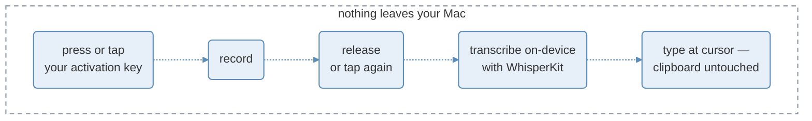

# Free Flow

Free Flow is a free, open-source macOS menu bar dictation app: hold (or tap) a key, speak, and your words appear at your cursor — transcribed entirely on-device with [WhisperKit](https://github.com/argmaxinc/WhisperKit).


[](LICENSE)

- works in any app you can type into — Slack, browser, terminal, IDE
- three activation modes (Hold, Single Tap, Double Tap) on your choice of ten keys
- clipboard-safe: text is typed straight in, your clipboard is never touched
- 100% on-device — no account, no telemetry, no subscription

<!-- TODO(screenshots): capture from the running app and drop into assets/
<table>
  <tr>
    <td width="50%" align="center">
      
      <br />
      <sub>Menu bar: Ready → Recording → Processing</sub>
    </td>
    <td width="50%" align="center">
      
      <br />
      <sub>Settings: activation key and mode</sub>
    </td>
  </tr>
</table>
-->

> [!NOTE]
> Free Flow **v0.1.0** is out — a signed, notarized release. Install via [Homebrew](#install), grab the [`.dmg`](https://github.com/abgregs/free-flow/releases/latest), or [build from source](#build-from-source).

## Why Free Flow?

The name is the pitch. **Free**, as in anywhere: one hotkey in every app you can paste into, not a voice mode locked to one tool. **Free**, as in open source: no account, no subscription, nothing leaving your Mac. **Flow**, as in staying in a highly focused mental state: speak the thought and stay in the work.

## How it works



The menu bar icon tracks each state of the cycle. Text is typed straight in at your cursor as synthesized keystrokes — Free Flow never reads or writes the system clipboard, so a dictation can't leak into your clipboard history and whatever you had copied is left exactly as it was.

> [!NOTE]
> First launch downloads the default model (~240 MB) from Hugging Face into `~/Library/Application Support/FreeFlow`. Every launch and dictation after that is fully offline.

## Features

| Feature | Details |
|---|---|
| Activation modes | Hold (push-to-talk), Single Tap, or Double Tap |
| Configurable key | Ten modifier-key options; default is Right Option |
| Clipboard untouched | Text is typed in via keystroke injection — your clipboard is never read or written; a guard skips non-editable targets |
| Live settings | Key and mode changes apply instantly — no restart |
| Guided onboarding | Step-by-step setup for Microphone, Input Monitoring, and Accessibility |
| Languages | English only for now; multilingual may come later |

## Install

```bash
brew install --cask abgregs/freeflow/freeflow
```

Or download the signed, notarized [`.dmg`](https://github.com/abgregs/free-flow/releases/latest) and drag Free Flow to Applications.

Requirements: macOS 14+ on Apple Silicon.

## Build from source

Requires only the Xcode Command Line Tools (`xcode-select --install`) — no full Xcode needed.

1. One-time: create a self-signed certificate named "Free Flow Dev" (Keychain Access → Certificate Assistant → Create a Certificate → Self Signed Root → Code Signing). Details in [docs/architecture/distribution.md](docs/architecture/distribution.md).
2. Build and install:
   ```bash
   git clone https://github.com/abgregs/free-flow.git
   cd free-flow
   swift build              # debug build
   swift test               # test suite
   make install             # release + sign + install to /Applications
   ```
3. Grant Microphone, Input Monitoring, and Accessibility when onboarding prompts you. Granting these to a self-built binary is a high-trust action — see [what you're trusting](docs/architecture/distribution.md).

Contributors: start at [docs/_index.md](docs/_index.md) — conventions, architecture, and the roadmap all live there.

## Acknowledgments

- [WhisperKit](https://github.com/argmaxinc/WhisperKit) (Argmax, MIT) — the on-device transcription engine
- [Whisper](https://github.com/openai/whisper) (OpenAI, MIT) — the speech models; code and weights are both MIT
- [swift-transformers](https://github.com/huggingface/swift-transformers) and [swift-jinja](https://github.com/huggingface/swift-jinja) (Hugging Face, Apache-2.0) — tokenizer and model-hub plumbing
- Apple's [swift-argument-parser](https://github.com/apple/swift-argument-parser), [swift-collections](https://github.com/apple/swift-collections), [swift-crypto](https://github.com/apple/swift-crypto), and [swift-asn1](https://github.com/apple/swift-asn1) (Apache-2.0), plus [yyjson](https://github.com/ibireme/yyjson) (MIT) — transitive via WhisperKit

Models are downloaded at runtime from [argmaxinc/whisperkit-coreml](https://huggingface.co/argmaxinc/whisperkit-coreml); this repository redistributes no model weights.

## License

[MIT](LICENSE) — every dependency is MIT or Apache-2.0.
